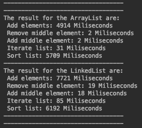

# ArrayList vs LinkedList
In this execirse show how is the performance of the arraylist and the linkedlist with 5 operations, which are:

- Add 10 million of elements
- Remove an element from the middle
- Insert in the middle a new element
- Iterate over the whole collection
- Sorting the collection

## Results

Theoretically ArrayList is better to access to any element of the list but LinkedList is better to add and remove any element of the list.

The result show that ArrayList is better in each operation but is neccesary do more tests with another implementation.

I am not happy with those results.