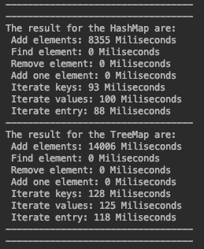

## Run project
```gradle
1. gradle build
2. gradle run
```

# HashMap vs TreeMap
In this execirse show how is the performance of the hashMap and the treeMap with 7 operations, which are:

- Add 10 million of elements
- Find an element from the Map
- Remove an element from the map
- Add an element
- Iterate over the whole collection with keys
- Iterate over the whole collection with values
- Iterate over the whole collection with entries

## Results


The result show that HashMap is better for adding a lot of elements and for iterating, but HashMap and TreeMap have the same performance to find, remove and add one element.
