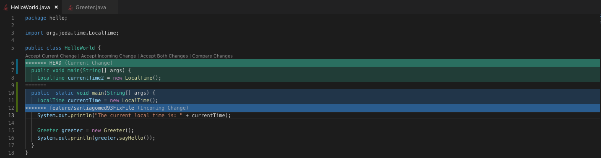
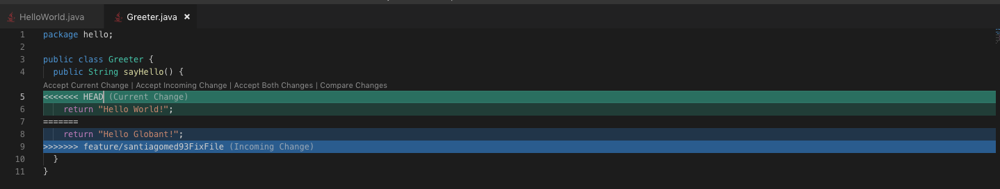

To run the project 
```gradle
./gradlew run
```

# Challenge week 1 git
- Create a file in master and a branch named bootcamp, modify
the file to create a conflict between the two branches and resolve the conflict.

- Generate a gitignore file to ignore the unnecessary files like the build folder

## Create a gitignore file
There are many ways to create a gitignore file, the best practice is create one in the root project, but in this time I will create one locally because in the challenge says that. To do that I used the page [gitignore.io](https://www.gitignore.io) and generated a gitignore file of java and gradle locally.

## Conflict
The conflict will be in the merge of two files, where I need save a fragment of one.




When my file is merged, it is ready to be push to the remote repository.

The commands used were:

```git
git branch feature/santiagomed93FixFile
```
Create a new branch

```git
git commit -a -m 'Fixed wrong files'
```
Commit the changes in the local branch

```git
git checkout santiagomed93
```
Change the local branch

```git
git merge feature/santiagomed93FixFile
````
Merge santiagomed93FixFile branch with the santiagomed93 branch

```git
resolve the conflicts
```

```git
git commit -a -m 'Merge with feature/santiagomed93FixFile branch'
````
Create the merge commit
