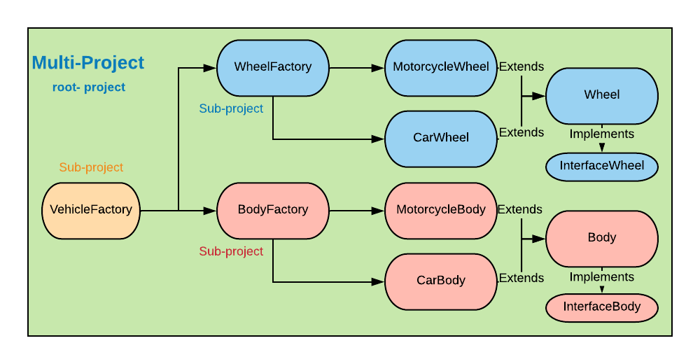

Run the project
```gradle
1. gradle build
2. gradle run
3. select a option and wait for the magic
```

# Description of the multi-project
This project try to test the concepts of multi- project with gradle, to do that I created a example of a "vehicle factory", where each part of the vehicle is a subproject used a factory like desing patterns.

