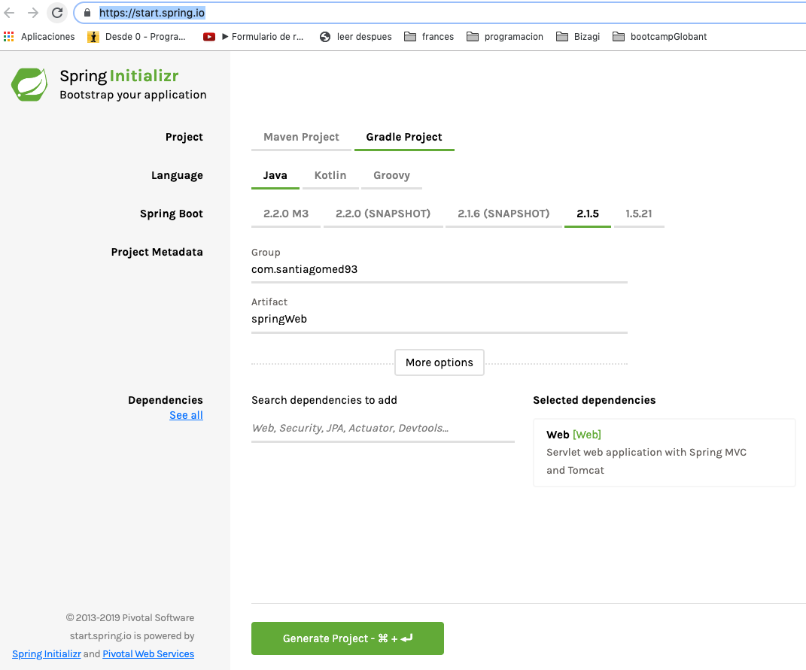

# Generate a gradle project with [Spring Boot](https://start.spring.io/)
For this challenge is neccesary generate a [spring boot](https://start.spring.io/) project with a spring-web dependecy. To do that in the section of dependencies select or write the option "Web" and then click in "Generate Project".

