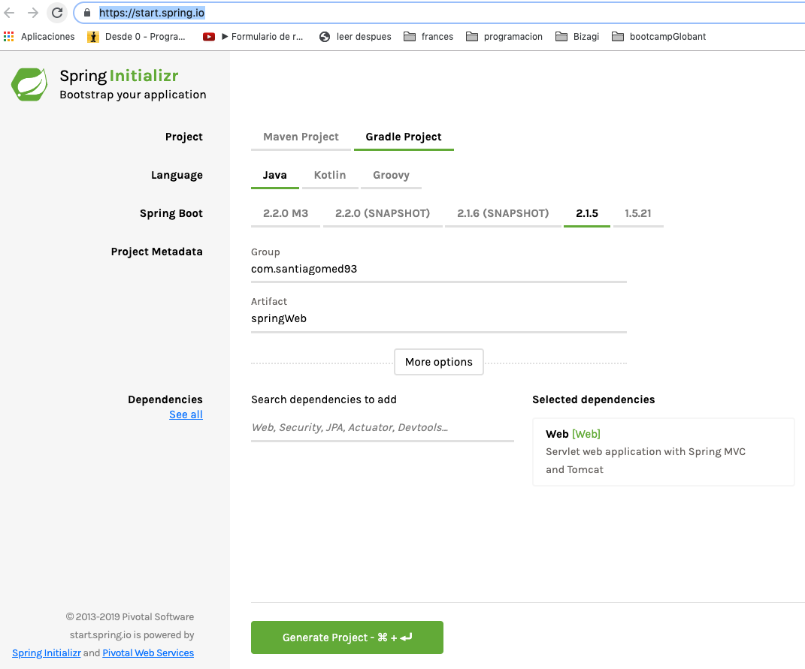

# Generate a gradle project with [Spring Boot](https://start.spring.io/)
For this challenge is neccesary generate a [spring boot](https://start.spring.io/) project with a spring-web dependecy. To do that in the section of dependencies select or write the option "Web" and then click in "Generate Project".



Include de sonar plugin to the gradle project with the next line into the build.gradle file in the plugins sections
```gradle
id "org.sonarqube" version "2.7.1"
```

And run the command
```gradle
gradle build
```
To build the project again.

Run the command
```gradle
gradle bootRun
```
to run the spring boot project