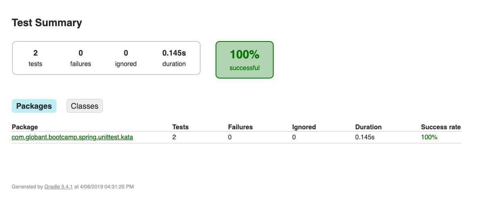

## Run the project
```gradle
1. gradle test
```
this command run the tests and generate a report in html in the path build/‎⁨⁨reports⁩/⁨tests⁩/⁨test⁩/index.html




# Fixing the Code
The implementation of the code is really good but there is a bug in the class AccountServiceImpl in the next line (line 30):


Because when I transfer money from one account to another, this money is subtracted from one account and added to another. To do that only is neccesary to change the operator (*) to (+):

